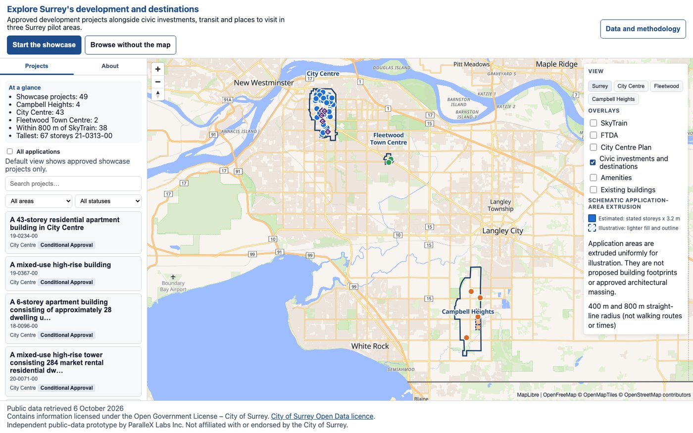
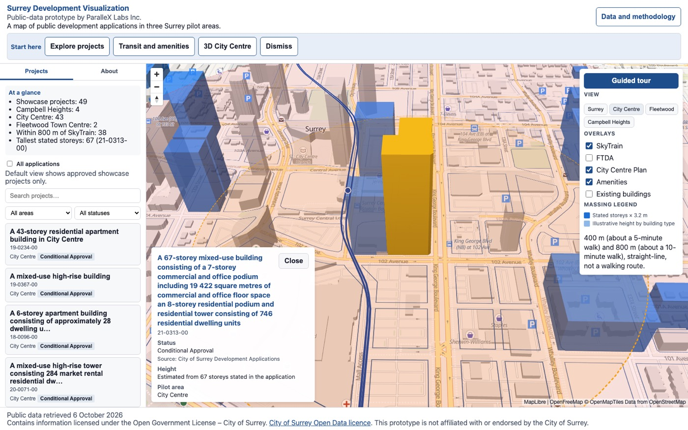
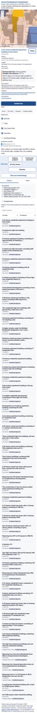

# Surrey Development Visualization (prototype)

A public-data prototype that maps development applications in three City of Surrey pilot areas: **City Centre**, **Fleetwood Town Centre**, and **Campbell Heights**.

Built by [ParalleX Labs Inc.](https://parallexlabs.ca/) This prototype is **not affiliated with or endorsed by the City of Surrey** and is not a regulatory record.

## Review it in one minute

1. Open the demo: https://parallexlabs.ca/demos/surrey/
2. Choose **Start the showcase**.
3. Open one project card and its City source link.
4. Open **Data and methodology**.
5. Copy a share link.

## Prototype boundaries

- Public data only.
- Heights are schematic.
- This is not a City service.
- No accessibility audit is claimed beyond the automated checks.

The checks that were run, and what was not done, are in [VERIFICATION.md](VERIFICATION.md).

**Live demo:** https://parallexlabs.ca/demos/surrey/



## Features

- **2D and 3D map**: pan, zoom, and tilt; switch to a pitched 3D view in City Centre.
- **Schematic application-area extrusion**: when an application description states a storey count, height is estimated as storeys × 3.2 m. When no storey count can be read, an illustrative height is used. The parser does not read heights stated in metres. Application areas are extruded uniformly for illustration. They are not proposed building footprints or approved architectural massing. See *Data and methodology* in the app and `src/heights.js`.
- **Project list and filters**: browse and filter applications without relying on the map; keyboard-accessible list with status and pilot-area filters.
- **Transit and amenity context**: SkyTrain lines and stations, Frequent Transit Development Areas, civic amenities, and optional City Centre Plan overlay.
- **Guided tour**: step-through introduction to the map, overlays, and project panel.
- **Shareable links**: the URL hash encodes the selected preset view and the selected project only. Manual camera position, zoom, pitch, and bearing are not preserved.
- **Accessibility**: skip link, visible focus, keyboard navigation, ARIA labels, and axe-tested states (see `npm run test:axe` locally).
- **Phone layout**: single-column layout with scrollable content, 16 px body text, and touch targets sized for mobile use.





## Data sources and licences

All geographic data ships in `public/data/`. City of Surrey layers come from the City's ArcGIS open-data services. SkyTrain and amenity features come from OpenStreetMap via the Overpass API.

See [DATA_LICENSE.md](DATA_LICENSE.md) for required attribution, source URLs, and basemap credits. A machine-readable source list is in `public/data/SOURCES.json`. The OpenStreetMap files, their attribution, and the ODbL link are also in [public/data/README.md](public/data/README.md).

The default project list is a rule-based selection using the source status, including conditional approval. That status is the City's application status. It is not a building permit and it does not say whether construction has started.

To refresh data from the public APIs (requires Python 3 and `shapely`):

```bash
pip install shapely
npm run fetch-data
```

## Run locally

Requirements: Node.js 22 LTS and npm.

```bash
npm ci
npm run dev
```

Open http://localhost:5173/

## Test

Unit tests include the Python 3 data tests. Those need Python 3 with Shapely (`pip install shapely`).

```bash
npm test
```

End-to-end tests (Playwright; needs a GPU-backed Chromium browser, not run in CI) need a site build first:

```bash
npm run build:site
npx playwright install chromium
npm run test:e2e
```

Accessibility scan (Playwright + axe):

```bash
npm run test:axe
```

## Build

Production build to `dist/`:

```bash
npm run build
npm run preview
```

Site build for `/demos/surrey/` deployment (writes `dist-site/`):

```bash
npm run build:site
```

## Open by design

- **Public inputs only**: no API keys, no proprietary datasets, and no backend beyond static files and public tile endpoints.
- **Documented method**: showcase inclusion rules, height estimation, and limitations are stated in the in-app *Data and methodology* panel (`src/methodology.js`).
- **Reproducible data**: `scripts/fetch_data.py` downloads the same public sources recorded in `SOURCES.json`.
- **No tracking**: the page does not use analytics or cookies. Third-party requests are limited to OpenFreeMap (style, tiles, fonts). The Start here dismissal from earlier builds is not on this page, so the app does not write sessionStorage.
- **Open source**: application code is licensed under [Apache-2.0](LICENSE). Data files remain under their respective open licences (see [DATA_LICENSE.md](DATA_LICENSE.md)).

## Licence

Copyright 2026 ParalleX Labs Inc. Code is licensed under the Apache License 2.0. See [LICENSE](LICENSE).
